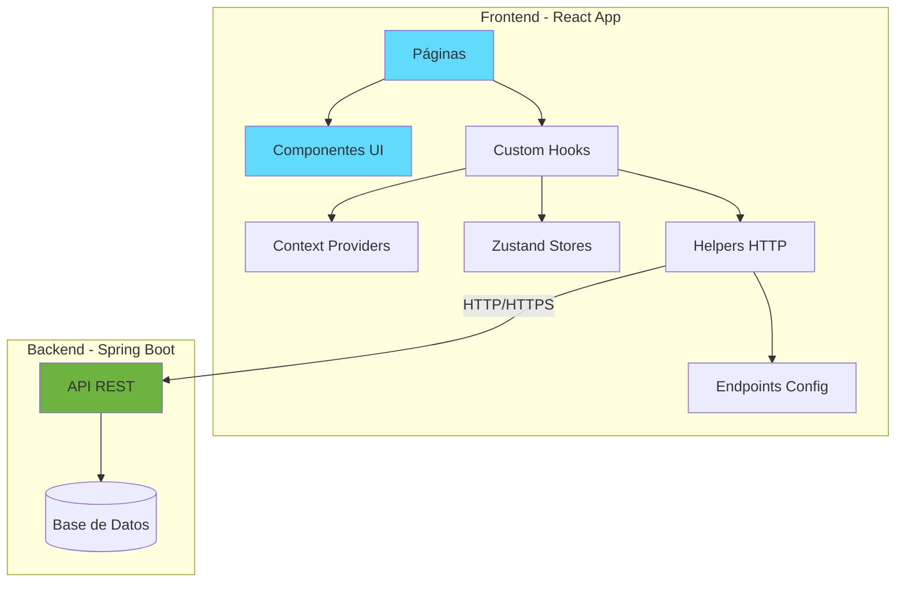
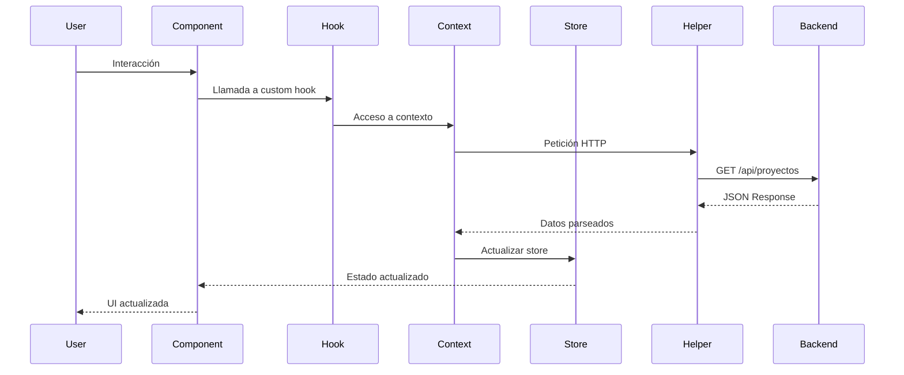
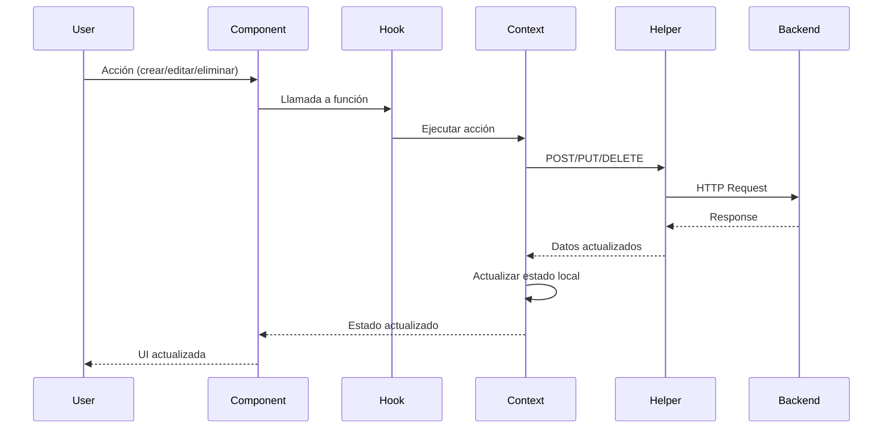

# Arquitectura del Frontend

Este documento describe la arquitectura del frontend de la aplicación Kanban, construida con React, JavaScript y Vite.

## Tabla de Contenidos

- [Visión General](#visión-general)
- [Diagrama de Arquitectura](#diagrama-de-arquitectura)
- [Estructura del Proyecto](#estructura-del-proyecto)
- [Capas de la Aplicación](#capas-de-la-aplicación)
- [Flujo de Datos](#flujo-de-datos)
- [Gestión de Estado](#gestión-de-estado)
- [Comunicación con el Backend](#comunicación-con-el-backend)
- [Patrones de Diseño](#patrones-de-diseño)
- [Optimizaciones](#optimizaciones)

## Visión General

La aplicación Kanban sigue una arquitectura de componentes basada en React con una clara separación de responsabilidades. El frontend se comunica con un backend Java Spring Boot a través de una API REST.

### Tecnologías Principales

- **React 18**: Biblioteca de UI con componentes funcionales y hooks
- **JavaScript ES6+**: Lenguaje de programación moderno
- **Vite**: Build tool y dev server de alta velocidad con SWC
- **Tailwind CSS**: Framework de utilidades CSS
- **Zustand**: Librería minimalista de gestión de estado
- **Context API**: API nativa de React para compartir estado
- **React Router DOM**: Enrutamiento del lado del cliente
- **Fetch API**: Cliente HTTP nativo del navegador

## Diagrama de Arquitectura



## Estructura del Proyecto

```
src/
├── api/                    # Configuración de endpoints
│   └── endpoints.js       # Definición de URLs del backend
│
├── assets/                # Recursos estáticos
│   └── react.svg         # Imágenes, iconos, etc.
│
├── components/            # Componentes reutilizables
│   ├── icons/            # Componentes de iconos
│   │   ├── AddBtn.jsx
│   │   ├── DeleteIcon.jsx
│   │   └── ...
│   ├── CreateProject.jsx
│   ├── CreateTask.jsx
│   ├── Header.jsx
│   ├── KanbanBoard.jsx
│   ├── TaskCard.jsx
│   └── ...
│
├── context/               # Context API providers
│   ├── dragContext.jsx   # Contexto para drag & drop
│   ├── projectsContex.jsx # Contexto de proyectos
│   └── tasksContext.jsx  # Contexto de tareas
│
├── helpers/               # Funciones auxiliares
│   ├── helpHTTP.js       # Helper para peticiones HTTP
│   └── helpTaskPosition.js # Helper para posición de tareas
│
├── hooks/                 # Custom hooks de React
│   ├── useConfirm.js     # Hook para confirmaciones
│   ├── useDragContext.js # Hook para drag & drop
│   ├── useForm.js        # Hook para formularios
│   ├── usePopUp.js       # Hook para pop-ups
│   ├── useProjectsContext.js
│   └── useTasksContext.js
│
├── Layouts/               # Componentes de layout
│   └── KanbanAppLayout.jsx
│
├── pages/                 # Componentes de páginas/vistas
│   ├── ErrorPage.jsx
│   ├── ProjectKanbanPage.jsx
│   └── ProjectsPage.jsx
│
├── routes/                # Configuración de rutas
│   └── index.jsx
│
├── store/                 # Stores de Zustand
│   ├── BackendAvailability.js
│   ├── projects.js
│   └── tasks.js
│
├── App.jsx                # Componente raíz
├── main.jsx               # Punto de entrada
└── index.css              # Estilos globales
```

## Capas de la Aplicación

### 1. Capa de Presentación (UI)

**Responsabilidad**: Renderizar la interfaz de usuario y manejar interacciones.

**Componentes**:

- `TaskCard`: Muestra una tarjeta de tarea individual
- `KanbanBoard`: Contenedor principal del tablero
- `Header`: Encabezado de la aplicación
- `CreateProject`, `CreateTask`: Formularios de creación

**Características**:

- Componentes funcionales con JavaScript
- Props documentadas con JSDoc cuando es necesario
- Uso de Tailwind CSS para estilos
- Componentes "tontos" (presentacionales) sin lógica de negocio

```javascript
/**
 * Componente de tarjeta de tarea
 * @param {Object} props
 * @param {Object} props.task - Objeto de tarea
 * @param {Function} props.onUpdate - Callback para actualizar
 * @param {Function} props.onDelete - Callback para eliminar
 */
const TaskCard = ({ task, onUpdate, onDelete }) => {
  return (
    <div className='bg-white p-4 rounded-lg shadow'>
      <h3>{task.title}</h3>
      <p>{task.description}</p>
    </div>
  )
}

export default TaskCard
```

### 2. Capa de Lógica (Hooks + Context)

**Responsabilidad**: Encapsular lógica de negocio y estado.

**Custom Hooks**:

- `useTasksContext`: Acceso al contexto de tareas
- `useProjectsContext`: Acceso al contexto de proyectos
- `useDragContext`: Lógica de drag & drop
- `useForm`: Manejo de formularios
- `useConfirm`: Confirmaciones de usuario
- `usePopUp`: Control de pop-ups

**Context Providers**:

- `TasksProvider`: Proveedor de estado de tareas
- `ProjectsProvider`: Proveedor de estado de proyectos
- `DragProvider`: Proveedor de estado de drag & drop

**Características**:

- Reutilización de lógica entre componentes
- Separación de concerns
- Manejo de efectos secundarios

```javascript
// hooks/useTasksContext.js
import { useContext } from 'react'
import { TasksContext } from '../context/tasksContext'

export const useTasksContext = () => {
  const context = useContext(TasksContext)
  if (!context) {
    throw new Error('useTasksContext debe usarse dentro de TasksProvider')
  }
  return context
}
```

### 3. Capa de Estado (Zustand Stores)

**Responsabilidad**: Gestión de estado global de la aplicación.

**Stores**:

- `useProjectsStore`: Estado de proyectos
- `useTasksStore`: Estado de tareas
- `useBackendAvailability`: Estado de disponibilidad del backend

**Características**:

- Estado global sin boilerplate
- Subscripción selectiva para optimización
- Fácil de testear

```javascript
// store/tasks.js
import { create } from 'zustand'

export const useTasksStore = create((set) => ({
  tasks: [],
  loading: false,
  error: null,

  setTasks: (tasks) => set({ tasks }),
  setLoading: (loading) => set({ loading }),
  setError: (error) => set({ error }),

  addTask: (task) =>
    set((state) => ({
      tasks: [...state.tasks, task]
    })),

  updateTask: (id, updates) =>
    set((state) => ({
      tasks: state.tasks.map((t) => (t.id === id ? { ...t, ...updates } : t))
    })),

  deleteTask: (id) =>
    set((state) => ({
      tasks: state.tasks.filter((t) => t.id !== id)
    }))
}))
```

### 4. Capa de Comunicación (Helpers + API)

**Responsabilidad**: Comunicación con el backend.

**Helpers**:

- `helpHTTP`: Funciones auxiliares para peticiones HTTP
- `helpTaskPosition`: Lógica de posicionamiento de tareas

**API Config**:

- `endpoints.js`: Definición centralizada de endpoints

**Características**:

- Abstracción de llamadas HTTP
- Manejo centralizado de errores
- Uso de Fetch API nativa

```javascript
// helpers/helpHTTP.js
export const helpHTTP = () => {
  const customFetch = async (endpoint, options = {}) => {
    const defaultHeaders = {
      'Content-Type': 'application/json'
    }

    const controller = new AbortController()
    options.signal = controller.signal

    options.method = options.method || 'GET'
    options.headers = options.headers
      ? { ...defaultHeaders, ...options.headers }
      : defaultHeaders

    options.body = JSON.stringify(options.body) || false
    if (!options.body) delete options.body

    setTimeout(() => controller.abort(), 10000)

    try {
      const res = await fetch(endpoint, options)
      const data = await res.json()

      if (!res.ok) {
        throw {
          status: res.status,
          statusText: res.statusText,
          data
        }
      }

      return data
    } catch (err) {
      return Promise.reject(err)
    }
  }

  const get = (url) => customFetch(url)
  const post = (url, body) => customFetch(url, { method: 'POST', body })
  const put = (url, body) => customFetch(url, { method: 'PUT', body })
  const del = (url) => customFetch(url, { method: 'DELETE' })

  return { get, post, put, del }
}
```

```javascript
// api/endpoints.js
const BASE_URL = import.meta.env.VITE_API_URL

const endPoints = {
  projects: {
    create: `${BASE_URL}/kanban-app/proyectos`,
    update: (id) => `${BASE_URL}/kanban-app/proyectos/${id}`,
    listAll: `${BASE_URL}/kanban-app/proyectos`,
    delete: (id) => `${BASE_URL}/kanban-app/proyectos/${id}`
  },
  tasks: {
    getProject: (id) => `${BASE_URL}/kanban-app/proyectos/${id}`,
    create: `${BASE_URL}/kanban-app/tareas`,
    updateState: (id) => `${BASE_URL}/kanban-app/estado/tareas/${id}`,
    delete: (id) => `${BASE_URL}/kanban-app/tareas/${id}`,
    update: (id) => `${BASE_URL}/kanban-app/tareas/${id}`,
    move: `${BASE_URL}/kanban-app/mover`
  },
  health: `${BASE_URL}/health`
}

export default endPoints
```

## Flujo de Datos

### Flujo de Lectura (GET)



### Flujo de Escritura (POST/PUT/DELETE)



## Gestión de Estado

### Estado Local (useState)

Para estado específico de componentes:

```javascript
const [isOpen, setIsOpen] = useState(false)
const [inputValue, setInputValue] = useState('')
```

### Estado Compartido (Context API)

Para estado compartido entre componentes relacionados:

```javascript
// context/tasksContext.jsx
import { createContext, useState } from 'react'

export const TasksContext = createContext()

export const TasksProvider = ({ children }) => {
  const [tasks, setTasks] = useState([])
  const [loading, setLoading] = useState(false)

  const value = {
    tasks,
    setTasks,
    loading,
    setLoading
  }

  return <TasksContext.Provider value={value}>{children}</TasksContext.Provider>
}
```

### Estado Global (Zustand)

Para estado verdaderamente global y optimizado:

```javascript
import { create } from 'zustand'

export const useBackendAvailability = create((set) => ({
  isAvailable: true,
  setAvailability: (isAvailable) => set({ isAvailable })
}))

// Uso en componentes
const { isAvailable, setAvailability } = useBackendAvailability()
```

## Comunicación con el Backend

### Uso del Helper HTTP

```javascript
import { helpHTTP } from '../helpers/helpHTTP'
import endPoints from '../api/endpoints'

const api = helpHTTP()

// GET
const fetchProjects = async () => {
  try {
    const data = await api.get(endPoints.projects.listAll)
    return data
  } catch (error) {
    console.error('Error fetching projects:', error)
    throw error
  }
}

// POST
const createTask = async (taskData) => {
  try {
    const data = await api.post(endPoints.tasks.create, taskData)
    return data
  } catch (error) {
    console.error('Error creating task:', error)
    throw error
  }
}

// PUT
const updateTask = async (id, updates) => {
  try {
    const data = await api.put(endPoints.tasks.update(id), updates)
    return data
  } catch (error) {
    console.error('Error updating task:', error)
    throw error
  }
}

// DELETE
const deleteTask = async (id) => {
  try {
    await api.del(endPoints.tasks.delete(id))
  } catch (error) {
    console.error('Error deleting task:', error)
    throw error
  }
}
```

### Manejo de Errores

```javascript
try {
  const data = await api.get(endPoints.projects.listAll)
  setProjects(data)
} catch (error) {
  if (error.status === 404) {
    setError('Proyectos no encontrados')
  } else if (error.status === 500) {
    setError('Error del servidor')
  } else {
    setError('Error de conexión')
  }
}
```

## Patrones de Diseño

### 1. Container/Presentational Pattern

**Container (Smart Component)**:

```javascript
const ProjectsPageContainer = () => {
  const { projects, loading, fetchProjects } = useProjectsContext()

  useEffect(() => {
    fetchProjects()
  }, [])

  if (loading) return <Loader />

  return <ProjectsContainer projects={projects} />
}
```

**Presentational (Dumb Component)**:

```javascript
const ProjectsContainer = ({ projects }) => {
  return (
    <div className='grid grid-cols-1 md:grid-cols-2 lg:grid-cols-3 gap-4'>
      {projects.map((project) => (
        <ProjectCard key={project.id} project={project} />
      ))}
    </div>
  )
}
```

### 2. Custom Hooks Pattern

Encapsular lógica reutilizable:

```javascript
const useForm = (initialValues = {}) => {
  const [values, setValues] = useState(initialValues)

  const handleChange = (e) => {
    const { name, value } = e.target
    setValues((prev) => ({ ...prev, [name]: value }))
  }

  const reset = () => setValues(initialValues)

  return { values, handleChange, reset }
}
```

### 3. Compound Components Pattern

Para componentes complejos con subcomponentes:

```javascript
const PopUpForm = ({ children, isOpen, onClose }) => {
  if (!isOpen) return null

  return (
    <div className='modal-overlay' onClick={onClose}>
      <div className='modal-content' onClick={(e) => e.stopPropagation()}>
        {children}
      </div>
    </div>
  )
}

// Uso
;<PopUpForm isOpen={isOpen} onClose={handleClose}>
  <h2>Crear Tarea</h2>
  <CreateTask onSubmit={handleSubmit} />
</PopUpForm>
```

## Optimizaciones

### 1. Code Splitting

```javascript
import { lazy, Suspense } from 'react'
import { Loader } from './components/Loader'

const ProjectKanbanPage = lazy(() => import('./pages/ProjectKanbanPage'))

function App() {
  return (
    <Suspense fallback={<Loader />}>
      <ProjectKanbanPage />
    </Suspense>
  )
}
```

### 2. Memoización

```javascript
import { useMemo, useCallback } from 'react'

// Componentes
const TaskCard = React.memo(({ task }) => {
  return <div>{task.title}</div>
})

// Valores calculados
const filteredTasks = useMemo(() => {
  return tasks.filter((task) => task.status === 'TODO')
}, [tasks])

// Callbacks
const handleClick = useCallback(() => {
  updateTask(task.id, { status: 'DONE' })
}, [task.id])
```

### 3. Optimización de Zustand

```javascript
// Subscripción selectiva
const tasks = useTasksStore((state) => state.tasks)
const loading = useTasksStore((state) => state.loading)

// En lugar de
const { tasks, loading } = useTasksStore()
```

### 4. Optimización de Bundle

Configuración en `vite.config.js`:

```javascript
export default defineConfig({
  plugins: [react()],
  build: {
    rollupOptions: {
      output: {
        manualChunks: {
          'react-vendor': ['react', 'react-dom', 'react-router-dom'],
          'state-vendor': ['zustand']
        }
      }
    }
  }
})
```

## Consideraciones de Seguridad

1. **Validación de Datos**: Validar datos en el frontend antes de enviar al backend
2. **Sanitización**: Evitar XSS sanitizando inputs del usuario
3. **HTTPS**: Usar siempre HTTPS en producción
4. **CORS**: Configurar CORS correctamente en el backend
5. **Timeout**: Implementar timeouts en peticiones HTTP (10 segundos)

## Próximos Pasos

- Implementar tests unitarios con Vitest
- Agregar tests de integración con React Testing Library
- Implementar PWA para funcionalidad offline
- Agregar internacionalización (i18n)
- Implementar telemetría y analytics
